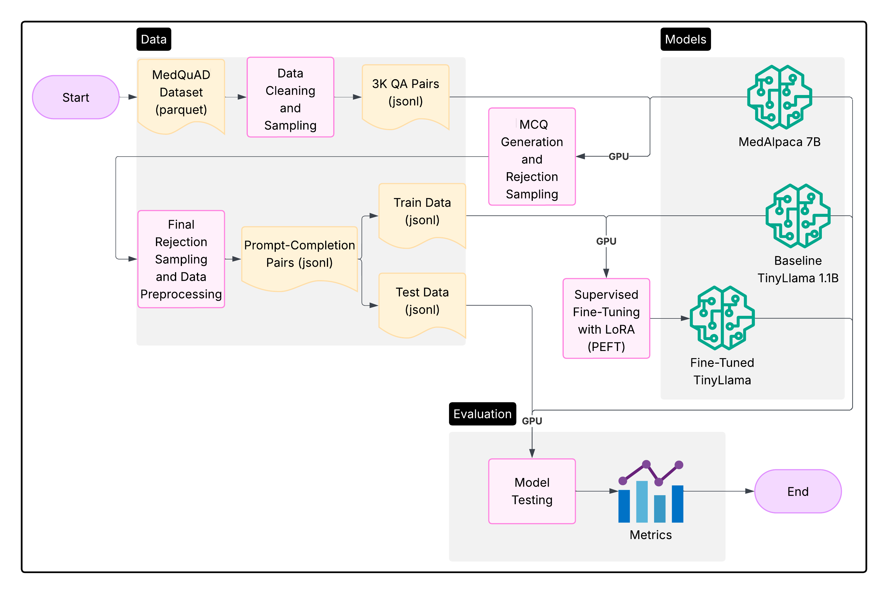

# Fine-Tuning TinyLlama for Medical QA

## Overview
Access to accurate, understandable medical information is essential, especially for laypersons without clinical expertise. This project explores how to improve layperson medical question answering (QA) by generating multiple-choice questions (MCQs) from the MedQuAD dataset and fine-tuning TinyLlama using a lightweight, parameter-efficient method.

## Approach
- **Dataset Curation:** Curated a small MCQ dataset from the MedQuAD dataset through rejection sampling and few-shot Chain-of-Thought (CoT) prompting.

- **Fine-Tuning:** Fine-tuned a TinyLlama baseline model using a lightweight, parameter-efficient method (LoRA).

## Key Results
The results demonstrated the potential of focused domain adaptation even on smaller foundation models:

- **Performance Gains:** Fine-tuning led to some gains over both the baseline TinyLlama and specialized MedAlpaca models.

- **Domain Adaptation:** Successfully adapted a lightweight LLM to a highly complex, regulated medical domain to improve layperson QA.

---

- Read the full paper [here](tinyllama-medical-qa-report.pdf)
- Check out the slide deck [here](tinyllama-medical-qa-slides.pdf)

## Notebooks
- [01-sample-data.ipynb](notebooks/01-sample-data.ipynb)
- [02-generate-mcqs.ipynb](notebooks/02-generate-mcqs.ipynb)
- [03-finetune-model.ipynb](notebooks/03-finetune-model.ipynb)
- [04-evaluate-models.ipynb](notebooks/04-evaluate-models.ipynb)
- [05-plot-results.ipynb](notebooks/05-plot-results.ipynb)

## Data
[huggingface.co/datasets/lavita/MedQuAD](https://huggingface.co/datasets/lavita/MedQuAD)
